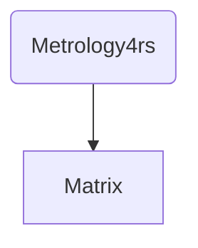

# Rust Metrology Library

$abc$

$$
qqw
$$



This library provides a collection of modules and functions for performing various metrology-related calculations.
It includes modules for handling matrices, dimensional analysis, and unit conversions.

## Modules

- `matrix`: Contains functions and structures for working with matrices.
- `dimensional`: Contains functions and structures for handling dimension definition.
- `dimensional_analysis`: Provides functionality for performing dimensional analysis.   
- `tests`: Contains unit tests for the library.
- `units`: using [QUDT](<http://www.qudt.org/>) to define the units.

## Usage

To use this library, add the following to your `Cargo.toml` file:

```toml
[dependencies]
metrology4rs = { git = "https://github.com/qchen-fdii-cardc/metrology4rs", version = "0.1.0" }
```

Then, in your Rust code, you can use the library as follows:

```rust
use num::rational::Rational32;
use metrology4rs::dimensional::*;
use metrology4rs::dimensional_analysis::*;

fn main() {
    let omega_dimension = LENGTH.pow(Rational32::new(-1, 2)) * 
         ACCELERATION.pow(Rational32::new(1, 2));

    println!("oemga dimension: {}", omega_dimension);

    let sys = DimensionalAnalysis{
        target: FREQUENCY, 
        dependencies: vec![LENGTH, MASS, ACCELERATION]};
    println!("{}", sys);
    let results = sys.solve();
    println!("{}", results);
}
```

## License

This project is licensed under the MIT License. See the [LICENSE](./LICENSE) file for details.