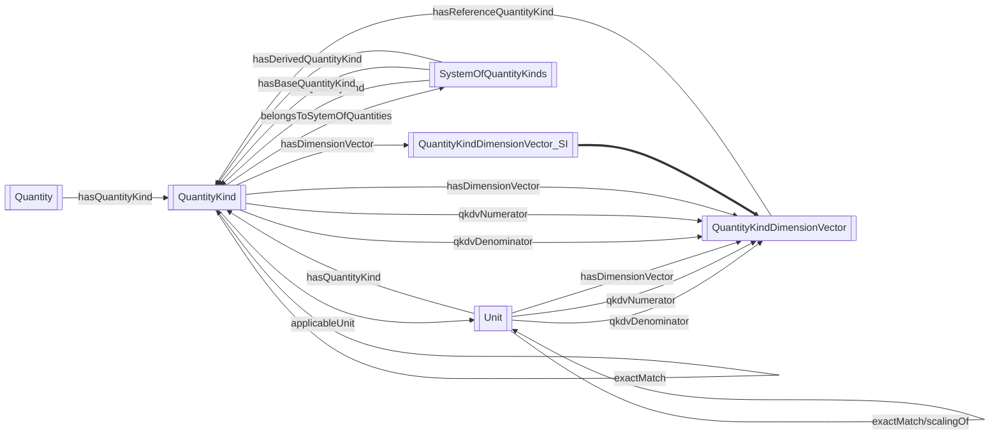

# QUDT Ontologies 简介 (Introduction)

## 概述 (Overview)

QUDT提供了一个统一的架构，用于概念化表示数量、数量种类、单位、维度和数据类型，这些都是所有科学和工程研究的核心。但QUDT规范不仅仅是一个核心架构和这些概念的列表，因为它实现了国际标准，从而为系统互操作性提供了基础。为了在信息系统之间提供互操作性和数据交换，规范需要以机器可处理的形式提供，且没有歧义。因此，QUDT在指定这些概念时采用了本体模型中精确的语义基础规范，并将其转换为机器可处理的表示形式。

QUDT presents a unified architecture for the conceptual representation of quantities, quantity kinds, units, dimensions, and data types, which lie at the core of all scientific and engineering inquiry. But the QUDT specification is more than a core architecture and a list of these concepts, because it implements international standards and thus provides the foundation for system interoperability. In order to provide for interoperability and data exchange between information systems, the specification needs to be available in a machine processable form, with no ambiguities. For these reasons, the QUDT approach to specifying these concepts is to use precise semantically grounded specifications in an ontology model with translation into machine-processable representations.

## 本体的优势 (Advantages of Ontologies)

本体提供了面向对象的封装、继承和多态性等优势，这些优势在其他结构化建模方法中是无法获得的。QUDT中建模的特征需要基于模型的方法，因为它们是功能依赖的。在不考虑其相互依赖关系的情况下对其进行建模，需要观察者来理解这些依赖关系，这会给建模方法带来歧义。这些模型（维度、坐标系统等）与其他一切一样都是分层的，因此使用不支持继承的语言来建模它们会对模型及其使用施加限制，这同样会导致歧义。

Ontologies provide the object-oriented strengths of encapsulation, inheritance, and polymorphism, strengths which are unavailable in other structured modeling approaches. The characteristics modeled in QUDT require a model-based approach because they are functionally dependent. Modeling one without modeling its dependency on the other requires that the understanding of those dependencies be carried by the observer, which injects ambiguity into the modeling approach. These models (dimensions, coordinate systems, etc.), like everything else, are hierarchical, so using a language to model them which doesn't support inheritance imposes constraints on the models and their use which, again, results in ambiguity.

## 系统互操作性支持 (System Interoperability Support)

QUDT通过以下四种方式支持系统互操作性：

1. 单位本体提供了一种明确指定单位的正式方法，从而避免了容易误解的默认约定。
2. QUDT区分给定单位的变体。例如，作为度量单位的英文单词"day"可能指平太阳日、恒星日或恰好等于86,400秒的时间长度。本体中这些对"day"的每种解释都作为不同的单位出现。
3. QUDT区分通常使用相同名称的不同类型的单位。例如，"second"可能指时间的度量或角度的度量。同样，每种用法在本体中都作为不同的术语出现。
4. 本体提供明确的转换信息，作为此类转换的单一参考点。

QUDT supports system interoperability in four ways:

1. The unit ontologies provide a formal way of specifying units explicitly, thereby avoiding tacit conventions that are prone to misinterpretation.
2. QUDT distinguishes between variants of a given unit. For example, the English word "day" interpreted as a unit of measure may refer to a mean solar day, a sidereal day, or the length of time equivalent to exactly 86,400 seconds. Each of these interpretations of "day" appears as a distinct unit in the ontology.
3. QUDT distinguishes between units of different types that are commonly referred to with the same name. For example, "second" may refer to a measure of time or a measure of angle. Again, each usage appears as a distinct term in the ontology.
4. The ontology provides explicit conversion information, serving as a single point of reference for such conversions.

## 标准基础 (Standards Foundation)

QUDT主要基于公制单位（SI）的国际标准，如"BIPM国际单位制"、"ISO单位和数量标准"以及"NIST国际单位制使用指南"所述。此外，QUDT还包括其他系统的单位，如力学的CGS单位、CGS EMU（电磁）单位、CGS-ESU（静电）单位和电动力学的高斯单位，以及自然单位的普朗克系统。还包括了大多数美制和英制单位的长度、重量和热量单位。我们希望并打算让QUDT成为统一世界各地使用的各种数量和单位本体以及各种标准的基础，包括但不限于IEC 61360、UCUM和UN/ECE。遵守这些标准的同时也要求QUDT能够验证其是否符合这些标准。QUDT本体正在转换为SHACL，并构建SHACL验证器以满足这一要求。

QUDT is based largely on the international standard for metric units (SI), as described in "BIPM International System of Units", the "ISO standards on Units and Quantities", and "The NIST Guide for the use of the International System of Units". In addition, QUDT includes units from other systems, such as CGS units for mechanics, CGS EMU (electromagnetic) units, CGS-ESU (electrostatic) units, and Gaussian units for electrodynamics, and the Planck system of natural units. Most US Customary and British Imperial units for length, weight, and heat are also included. It is the hope and intention that QUDT form the basis for a unification of the various quantity and unit ontologies and the various standards that represent them in use around the world, including but not limited to IEC 61360, UCUM, and UN/ECE. Compliance with these standards comes along with it a requirement that QUDT be verifiable as being compliant with them. The QUDT ontologies are being converted to SHACL with the construction of SHACL validators to meet this requirement.

## 单位转换 (Unit Conversion)

在适用的情况下，SI标准用于非SI单位之间的转换。要从单位U1转换到U2，首先将U1转换为SI（相应SI单位的等效值），然后将SI转换为U2。在QUDT本体中，每个单位都有一个相应的转换乘数，将该乘数乘以数量以将当前单位转换为相应的SI单位。因此，如果N1和N2分别是U1和U2的转换乘数，则从U1转换到U2的正确因子是N1/N2。单位转换数据主要来自国家标准与技术研究院（NIST）提供的基本常数值，如"NIST常数、单位和不确定性参考"中所述。

Wherever applicable, the SI standard is used for conversions between non-SI units. To convert from unit U1 to U2, one first converts U1 to SI (the equivalent value in the appropriate SI unit), then converts SI to U2. In the QUDT Ontologies, each unit has a corresponding conversion multiplier, which multiplied to quantities to convert from the current unit to the corresponding SI unit. So, if N1 and N2 are the conversion multipliers for U1 and U2 respectively, then the proper factor to convert from U1 to U2 is N1/N2. Unit conversion data was largely derived from the values given by the National Institute of Standards and Technology (NIST) for fundamental constants, as documented in "The NIST Reference on Constants, Units, and Uncertainty".

## 语义基础 (Semantic Foundation)

QUDT语义基于OWL Web本体语言（[OWL](<http://www.w3.org/2004/OWL/>)）表达的维度分析。维度方法使用数字因子和在一组基本维度上定义的指数向量，将每个单位与基本单位系统关联起来。通过这种方式，每个基本单位在导出单位中的作用都被精确定义。进一步的关系建立了单位和数量种类的语义。通过这种方式，QUDT支持对数量和单位的推理。QUDT模型可以根据需要转换为其他机器处理的表示形式，或其他编程语言结构。以下各节简要定义了QUDT本体中主要关注的对象及其与数量、单位、维度和数据类型的正式规范的相关性。

QUDT semantics are based on dimensional analysis expressed in the OWL Web Ontology Language ([OWL](<http://www.w3.org/2004/OWL/>)). The dimensional approach relates each unit to a system of base units using numeric factors and a vector of exponents defined over a set of fundamental dimensions. In this way, the role of each base unit in the derived unit is precisely defined. A further relationship establishes the semantics of units and quantity kinds. By this means, QUDT supports reasoning over quantities as well as units. QUDT models may be translated into other representations for machine processing, or other programming language structures according to need. The following sections briefly define the primary objects of interest in the QUDT ontology and their relevance to the formal specification of quantities, units, dimensions and data types.

## 模块介绍

This module contains the QUDT unit definitions. using RDF/XML syntax to load the QUDT ontology, provides a set of unit definitions and conversion functions for various physical quantities

The QUDT ontology is a standard for representing units of measurement and physical quantities
in RDF/XML format. It provides a comprehensive set of unit definitions and conversion functions
for various physical quantities, including length, mass, time, temperature, and more.

The QUDT ontology is widely used in scientific and engineering applications, and is supported by
many software tools and libraries. It is an important resource for anyone working with physical quantities
and units of measurement, and provides a standardized way to represent and manipulate these concepts
in software applications.

The QUDT ontology is available at: [Website](<http://www.qudt.org/>)

The QUDT ontology is licensed under the Apache License, Version 2.0. See the LICENSE file for details.

## QUDT本体架构

### QuantityKind

